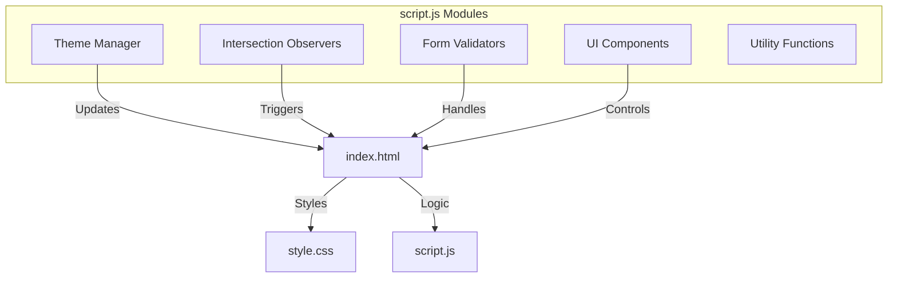
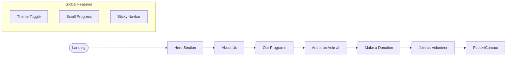
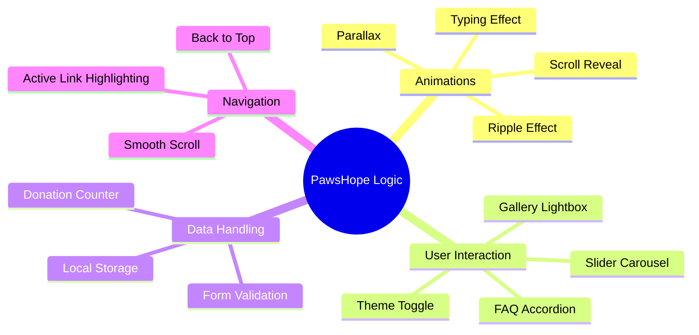

# 🐾 PawsHope — Animal Charity Website

**PawsHope** is a premium, fully responsive, and feature-rich website for an animal charity organization. Built with a "Mobile-First" approach using **Vanilla JavaScript**, **HTML5**, and **Modern CSS**, it provides a seamless user experience with high-end aesthetics, micro-interactions, and functional interactive components.

---

## 📸 Overview
The project aims to provide a professional platform for animal rescue, rehabilitation, and adoption. It features a stunning dark/light mode, smooth scroll animations, and interactive forms for donations and volunteering.

---

## 🚀 Key Features

### 🎨 Design & Aesthetics
- **Dark/Light Mode**: Full theme support with persistent state saving in local storage.
- **Glassmorphism**: Modern UI using backdrop filters, subtle borders, and soft shadows.
- **Dynamic Animations**: 
  - **Hero Typing Effect**: Rotating taglines in the header.
  - **Scroll Reveal**: Elements fade and slide into view as you scroll.
  - **Parallax Effects**: Interactive background and mouse-following blobs.
  - **Button Ripples**: Material-design style ripple effects on clicks.

### 🛠️ Functionality
- **Interactive Forms**:
  - **Volunteer Registration**: Real-time validation for names, emails, and phone numbers.
  - **Donation System**: Interactive amount selection cards and goal progress bar.
  - **Contact Form**: Direct messaging interface with success feedback.
- **Content Management**:
  - **Animal Adoption Cards**: Featuring "favourite" toggles and status badges.
  - **Success Stories Slider**: Auto-sliding testimonial carousel with manual controls.
  - **Gallery Lightbox**: Full-screen image viewing experience.
  - **FAQ Accordion**: Clean, space-saving toggle for common questions.
- **Utilities**:
  - **Live Donation Ticker**: Rotating news bar showing recent activity.
  - **Scroll Progress**: Visual bar at the top showing reading progress.
  - **Back-to-Top**: Quick navigation button appearing after scroll.
  - **Page Loader**: Custom paw-print loading screen.

---

## 📊 Project Structure & Logic

### System Architecture


### User Navigation Flow


### Feature Logic Mapping


---

## 🛠️ Technology Stack
- **HTML5**: Semantic structure and modern accessibility.
- **CSS3**: Custom properties (variables), Grid, Flexbox, and complex animations.
- **JavaScript (ES6+)**: Vanilla JS for logic, DOM manipulation, and state management.
- **Google Fonts**: Playfair Display (Serif) and Nunito/Poppins (Sans-serif).
- **Icons**: Emoji-based and custom CSS icons for lightweight performance.

---

## 📁 File Organization
```text
/PawsHope-Animal-Charity
│
├── index.html    # Main structure and content
├── style.css     # Global styles and design system
└── script.js    # Interactive logic and functionality
```

---

## 🏁 Getting Started

1. **Clone the repository**:
   ```bash
   git clone https://github.com/your-username/pawshope-charity.git
   ```
2. **Open the project**:
   - Simply open `index.html` in any modern web browser.
   - Or use a local server like **Live Server** in VS Code for the best experience.

---

## 🤝 Contribution
Contributions are welcome! If you have suggestions for new features or improvements, feel free to fork the repo and submit a pull request.

---

*Made with ❤️ for animals by PawsHope Team.*
